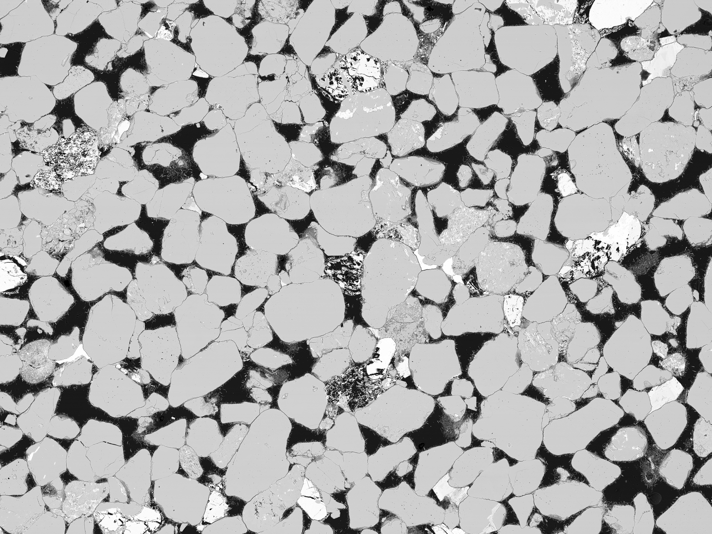
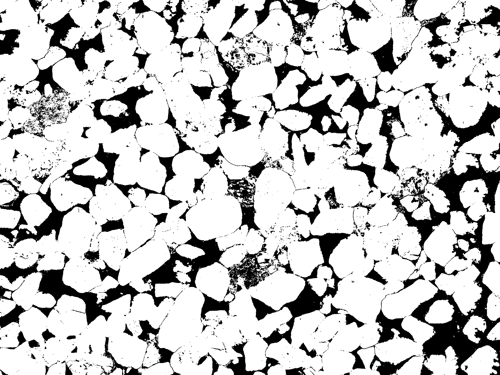

# gray2binary

Tool for creating black&white segmented images from grayscale images of porous
material. This tool uses watershed segmentation algorithm.

~~~~
Usage: gray2binary INPUT OUTPUT LOW HIGH

Description of arguments
HIGH       Threshold for the white phase
LOW        Threshold for the black phase
OUTPUT     Output picture
INPUT      Input picture
~~~~

The third and the fourth arguments can be used for tuning thresholds for black
(void) and white (solid) areas.

## Caveats

* Portable bitmap is the only output format supported at the moment.
* Some fine tuning of arguments may be required to get a good result.
* Processing of big images can take some time.

## Examples

| Original           | Segmented               |
|--------------------|-------------------------|
|  |  |

Original image was taken from:

Scott, G. (2020, January 16). North Sea Sandstone SEM Images. Retrieved May 05, 2022, from www.digitalrocksportal.org
